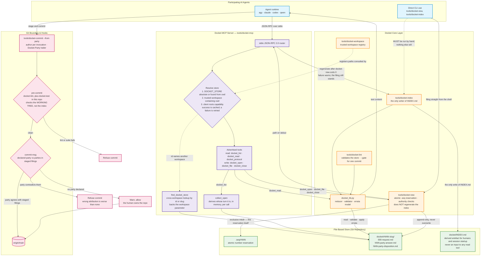
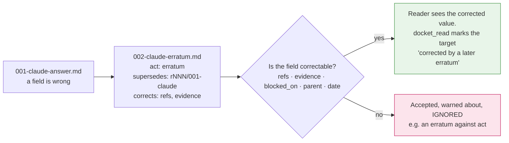

# Docket MCP Process Flow & Architecture

This document visualizes the end-to-end architecture and runtime lifecycle of the
**Docket** protocol and tooling.

Corrections in this revision were established by review in `r024`; the reasoning
behind the non-obvious ones is kept inline so a later editor does not undo them.

---

## 1. System Architecture & Component Interactions



### Two things the diagram is drawn to make unmissable

**`docket-new` never regenerates the index.** The only caller of `docket-index`
is `docket-mcp`, in `run_new`, after `docket-new` has exited 0. So a filing made
**through the CLI leaves `INDEX.md` stale** until someone runs
`python3 tools/docket-index <store>` by hand. If the reindex fails, the MCP write
still reports success and appends a warning naming the repair — the filing is
already on disk and immutable, and reporting the whole call as failed would
invite a retry that writes a duplicate nobody can delete.

**The read path never touches `INDEX.md`.** `docket_list` derives state live
through `collect_open`, and `docket_read` goes through `docket_lib`. Neither
reads the index. A stale `INDEX.md` misleads humans and session startup; it
cannot corrupt a tool result.

---

## 2. Multi-Agent Lifecycle & Turn Handoff

Two shapes matter. The first is the ordinary one — the assignee answers and the
**requester** owes the next move. The second is a handoff, where the assignee
names a different party.

```mermaid
sequenceDiagram
    autonumber
    participant Req as Requester (agy)
    participant MCP as Docket MCP Server
    participant New as docket-new
    participant Idx as docket-index
    participant Disk as Local Git Store
    participant Asg as Assignee (claude)
    participant Git as Git Remote

    Note over Req,Disk: Step 1 — Opening a docket
    Req->>MCP: docket_open(slug, title, body, assignee: claude, workspace?)
    MCP->>New: kind=request, --from agy
    New->>Disk: atomic mkdir .seq/rNNN
    New->>Disk: write 000-request.md (status: open, assignee: claude)
    New-->>MCP: path on stdout
    MCP->>Idx: regenerate
    Idx->>Disk: write INDEX.md (waiting_on: claude)
    MCP-->>Req: filed docket/rNNN-slug/000-request.md
    Req->>Git: docket-commit --from agy && git push

    Note over Asg,Disk: Step 2 — The ordinary answer, with no reassignment
    Asg->>MCP: docket_list (waiting_on: claude)
    Asg->>MCP: docket_read(rNNN)
    Asg->>MCP: docket_file(act: answer, body)
    MCP->>New: kind=filing, --from claude
    New->>Disk: write 001-claude-answer.md
    MCP->>Idx: regenerate
    Note right of Idx: assignee is unchanged, so the reducer routes<br/>waiting_on back to the REQUESTER, who now owes<br/>a close, an objection or a follow-up.<br/>This is correct behaviour, not a stale field.
    Idx->>Disk: write INDEX.md (waiting_on: agy)
    Asg->>Git: docket-commit --from claude && git push

    Note over Asg,Disk: Step 2b — Handoff, only when a third party should act
    Asg->>MCP: docket_file(act: answer, body, assignee: codex)
    Note right of Asg: only the requester or the current assignee<br/>may reassign; anyone else is refused
    MCP->>Idx: regenerate
    Idx->>Disk: write INDEX.md (waiting_on: codex)

    Note over Req,Disk: Step 3 — Resolution and closure
    Req->>MCP: docket_close(status: resolved, evidence: [...])
    MCP->>New: kind=close, --from agy — requester authority verified
    New->>Disk: write 00N-agy-disposition.md (status: resolved)
    MCP->>Idx: regenerate
    Idx->>Disk: write INDEX.md (closed +1)
    Req->>Git: docket-commit --from agy && git push
```

---

## 3. Correcting a Filing — Errata

Filings are immutable, so a mistake is corrected by **appending**, never by
editing. This is the one flow whose rules are not guessable from the tool names.



A party may only correct **its own** filings. The original is never touched: both
filings stay on disk, and the correction is applied at read time by the reducer.

---

## 4. Key Design Principles

1. **Identity is an ergonomic guard, not authentication.**
   `DOCKET_PARTY` is bound at registration and no MCP tool takes a `from`
   argument, so an agent working through MCP has no forging affordance. That is
   the whole of the guarantee. The CLI takes `--from <party>` for any party in
   `PARTIES.md`, every party shares one clone, one OS user and one key, and every
   name written inside a filing is self-asserted (PROTOCOL §7). Nothing here
   authenticates anyone, and no document should suggest otherwise.

2. **Strict append-only immutability.**
   No tool overwrites or deletes a filing. Corrections are appended as errata
   (§3). This is also why a guess is dangerous — a docket opened in the wrong
   store cannot be withdrawn by anyone but its requester.

3. **Write-time authority enforcement.**
   Only the requester — the party named in `000-request.md`, which is derived and
   never written as a field — may close a docket. Any other party proposing
   closure files `act: answer`. Reassignment and `status: blocked` are gated to
   the requester or the current assignee.

4. **Turn routing is derived, never authored.**
   `waiting_on` is computed by `docket_lib.reduce_docket` from the filings alone;
   no party writes it. `assignee` is authored and persistent; `requester` is
   derived and immutable. There is deliberately no `implementer` field — a
   reducer cannot infer an implementer nobody wrote down, so such a field would
   carry the same hand-maintained fact with the same omission risk (`r022`).

5. **Two git hooks, with different jobs.**
   `pre-commit` runs `docket-lint` — `--gate`d to the filings in the commit — and
   the full `docket-test` suite when this is the toolchain's own repository. It
   inspects the **working tree, not the staged content**, so a partial `git add`
   can commit a state it never saw. `commit-msg` then compares the declared party
   (the `Docket-Party:` trailer, falling back to the author name only when that
   looks like a party name) against the parties named in staged filings, and has
   three outcomes: agreement passes, contradiction is **blocked**, and a commit
   declaring no party at all is **warned about and allowed** — the human
   committing tooling does not answer to this hook.

6. **The store is a single linear trunk.**
   `.seq` mutual exclusion is an atomic `mkdir`, and it is only mutual exclusion
   on **one shared filesystem**. Parties on separate branches or worktrees each
   allocate against their own copy and reach the same next number.

   The damage is not the conflict you would expect. `.seq/rNNN/claimed` does
   conflict, but it is a marker rather than a filing — §1 does not apply and
   resolving it is harmless. The docket directories are at *different paths*, so
   git merges both **silently**, leaving two dockets sharing one id that cannot
   be renumbered without renaming filings. A conflict would at least halt the
   merge; this does not.

   PROTOCOL.md §5b states the normative rule: all Docket-store writes MUST be
   serialized through one allocation trunk. Source may branch; `docket/` may not
   (`r023`, `r028`).
