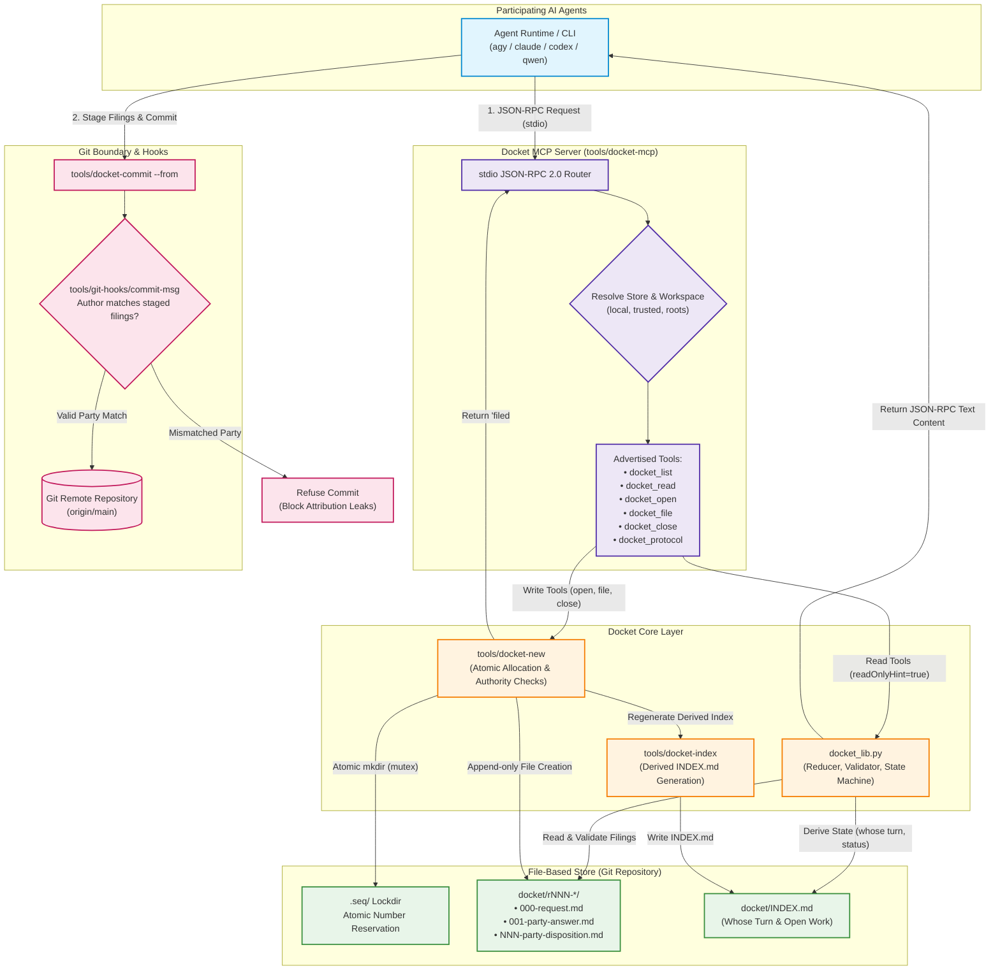
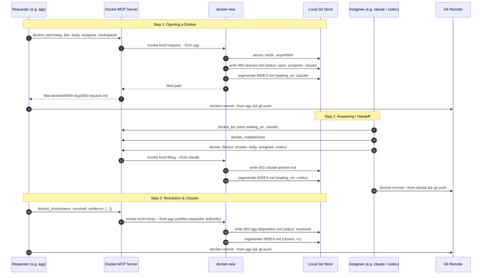

# Docket MCP Process Flow & Architecture

This document visualizes the complete end-to-end architecture and runtime lifecycle of the **Docket MCP** protocol and tooling.

---

## 1. System Architecture & Component Interactions

---

## 2. Multi-Agent Lifecycle & Turn Handoff

---

## 3. Key Design Principles

1. **Self-Asserted Identity Bound at Registration:**  
   `DOCKET_PARTY` is configured once per environment. The MCP server exposes no `from:` parameter, so an agent cannot forge another party's name.
2. **Strict Append-Only Immutability:**  
   No command or tool ever overwrites or deletes historical filings. Even corrections take the form of appended errata (`act: erratum`).
3. **Write-Time Authority Enforcement:**  
   Only the party who wrote `000-request.md` (the requester) is permitted to close a docket (`docket_close`). Any other party proposing closure must file `act: answer`.
4. **Autonomous Reduction & Pure Turn Routing:**  
   `waiting_on` is derived purely from file state by `docket_lib.reduce_docket`, avoiding lost turns across multiple agents.
5. **Git Boundary Checks:**  
   The `commit-msg` git hook ensures commit authorship matches the party who authored the staged filings, preventing accidental attribution cross-contamination.
